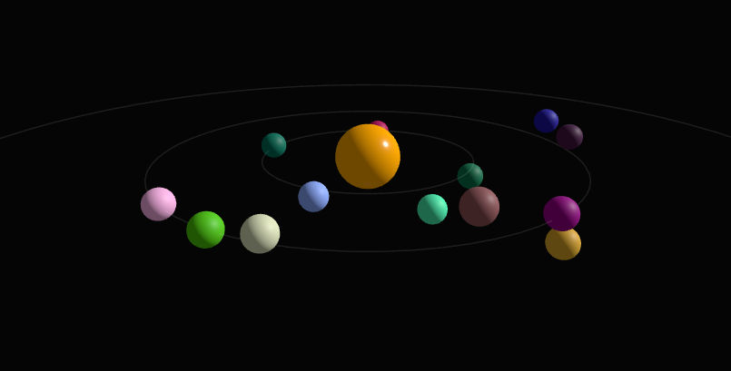
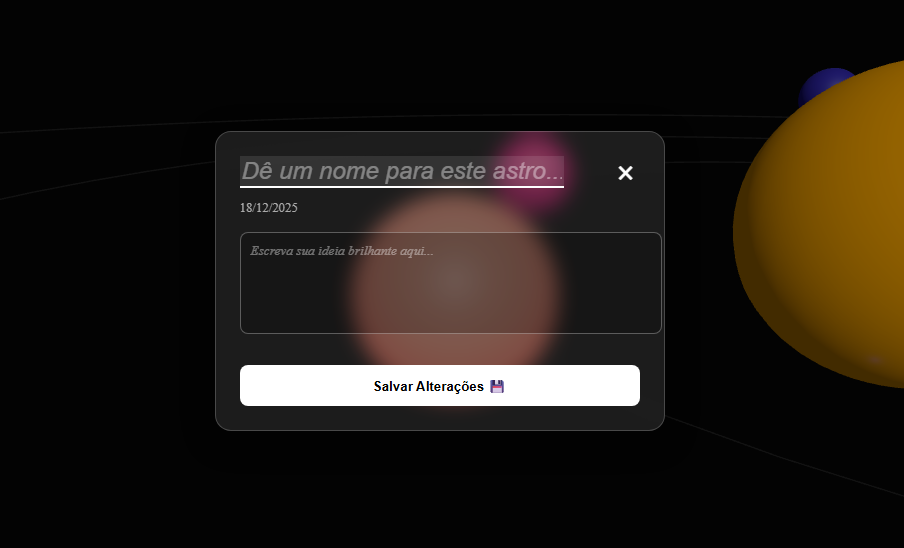

# 🌌 Universe of Notes (3D Portfolio & Note Manager)


> **"Uma aplicação interativa onde ideias orbitam como planetas em um sistema solar digital."**

[🔴 DEMO ONLINE (Clique Aqui)]((https://universe-of-notes.vercel.app/)) 

---

## 📖 Sobre o Projeto

O **Universe of Notes** é uma aplicação web Fullstack (Frontend + Persistência Local) que reimagina a forma como organizamos pensamentos. Em vez de listas tradicionais, as notas são visualizadas como **astros 3D** em um sistema solar interativo.

O projeto combina a robustez do **Angular** para a lógica de aplicação com o poder do **Three.js** para renderização gráfica em tempo real, criando uma experiência de usuário imersiva e espacial.

### ✨ Funcionalidades Principais

* **Visualização 3D Imersiva:** Navegação livre (zoom, rotação e pan) por um universo renderizado em WebGL.
* **Arquitetura de Sistema Solar:**
    * **O Sol (Core):** Uma nota central imutável que ancora o sistema.
    * **Órbitas Dinâmicas:** Notas adicionadas são posicionadas matematicamente em órbitas concêntricas (cálculo polar) para evitar sobreposição.
* **CRUD Completo & Persistência:**
    * Criação, Leitura, Edição e Exclusão de notas.
    * Uso de **LocalStorage** para salvar o universo no navegador do usuário.
* **Navegação Inteligente (Camera Travel):**
    * **Busca Rápida:** Filtra notas por título ou conteúdo.
    * **Focus Animation:** Ao selecionar um astro, a câmera viaja suavemente até ele e trava a rotação do universo para leitura.
    * **Zoom Out Automático:** Ao fechar uma nota ou excluir, a câmera retorna para uma visão panorâmica do sistema.
* **Design Responsivo:** O renderizador 3D se adapta a qualquer tamanho de tela (Mobile/Desktop).

---

## 🛠️ Tecnologias Utilizadas

O projeto foi construído utilizando as melhores práticas de desenvolvimento moderno:

### Core
* **Angular (v16+):** Framework principal. Utilizado para gerenciamento de estado, rotas, injeção de dependência e componentização da interface (UI Overlay).
* **Three.js:** Biblioteca base para a criação da cena 3D, câmeras, iluminação, geometrias e materiais (PBR).
* **TypeScript:** Garante a tipagem estática, fundamental para a matemática vetorial e integridade dos dados (Interfaces `NoteData`, `Vector3`).

### Estilização & UI
* **SCSS (Sass):** Estilização aninhada e modular para a interface flutuante (HUD) sobreposta ao Canvas 3D.
* **HTML5 Canvas:** O palco onde o Three.js desenha o universo.

### Lógica & Matemática
* **Raycasting:** Algoritmo utilizado para detectar cliques do mouse nos objetos 3D (interseção de vetores).
* **Matemática Polar/Cartesiana:** Conversão de ângulos e raios para coordenadas X, Y, Z para distribuir os planetas em anéis perfeitos.
* **Local Storage API:** Simulação de banco de dados para persistência de dados no cliente.

---

## 📸 Screenshots

*(Espaço reservado para você colocar prints do seu projeto. Sugestão: Tire um print do sistema solar inteiro e outro da nota aberta)*

| Visão Geral do Sistema | Edição de Nota |
|:---:|:---:|
|  |  |

---

## 🚀 Como Rodar Localmente

Pré-requisitos: Você precisa ter o [Node.js](https://nodejs.org/) e o [Angular CLI](https://angular.io/cli) instalados.

1.  **Clone o repositório:**
    ```bash
    git clone [https://github.com/SEU-USUARIO/NOME-DO-REPO.git](https://github.com/SEU-USUARIO/NOME-DO-REPO.git)
    ```

2.  **Entre na pasta:**
    ```bash
    cd NOME-DO-REPO
    ```

3.  **Instale as dependências:**
    ```bash
    npm install
    ```

4.  **Rode o servidor de desenvolvimento:**
    ```bash
    ng serve
    ```

5.  **Acesse:** Abra seu navegador em `http://localhost:4200/`.

---

## 🧠 Desafios Técnicos Superados

Durante o desenvolvimento, focamos em resolver problemas complexos de UX em ambientes 3D:

1.  **Gerenciamento de Câmera:** Implementação de lógica para transitar a câmera suavemente entre coordenadas globais (`WorldPosition`) sem perder o alvo quando o grupo de objetos está rotacionando.
2.  **Performance:** Otimização do loop de renderização (`requestAnimationFrame`) para garantir 60 FPS, pausando rotações desnecessárias durante a edição.
3.  **Interação Híbrida:** Tratamento de conflitos de eventos de clique entre o DOM (botões HTML) e o Canvas (Objetos 3D), garantindo que clicar em um botão não acione o Raycaster atrás dele.

---

## 🔮 Próximos Passos (Roadmap)

* [ ] Adicionar texturas realistas aos planetas (Shaders).
* [ ] Implementar um campo de estrelas (Starfield) procedural ao fundo.
* [ ] Backend real com Firebase ou Node.js para salvar notas na nuvem.
* [ ] Efeito de "Constelação" (linhas conectando notas relacionadas).

---

## 🤝 Contribuição

Contribuições são bem-vindas! Sinta-se à vontade para abrir issues ou enviar Pull Requests.

---

Developed with 💜 by **[Felipe Diggelmann de Camargo]**
